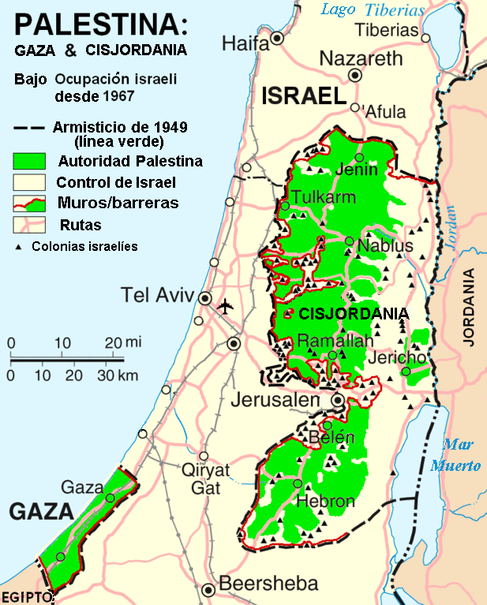

# ISR-PAL

El conflicto israelí-palestino es el conflicto social y armado en curso entre israelíes y palestinos por el control de la tierra de Palestina, que se remonta a principios del siglo xx.

El conflicto, de gran envergadura, forma parte importante del conflicto árabe-israelí.

Solo nos hemos puesto a analizar dicha contienda, datos puestos, sacados de la pagina


## Datos
* [Kaggle]([https://www.ruby-lang.org/es/](https://www.kaggle.com/datasets/willianoliveiragibin/fatalities-in-the-israeli-palestinian)https://www.kaggle.com/datasets/willianoliveiragibin/fatalities-in-the-israeli-palestinian)

## Historia
Israel
```bash
https://es.wikipedia.org/wiki/Israel
```

Palestina
```bash
https://es.wikipedia.org/wiki/Palestina_(regi%C3%B3n)
```

## Screenshots
 
